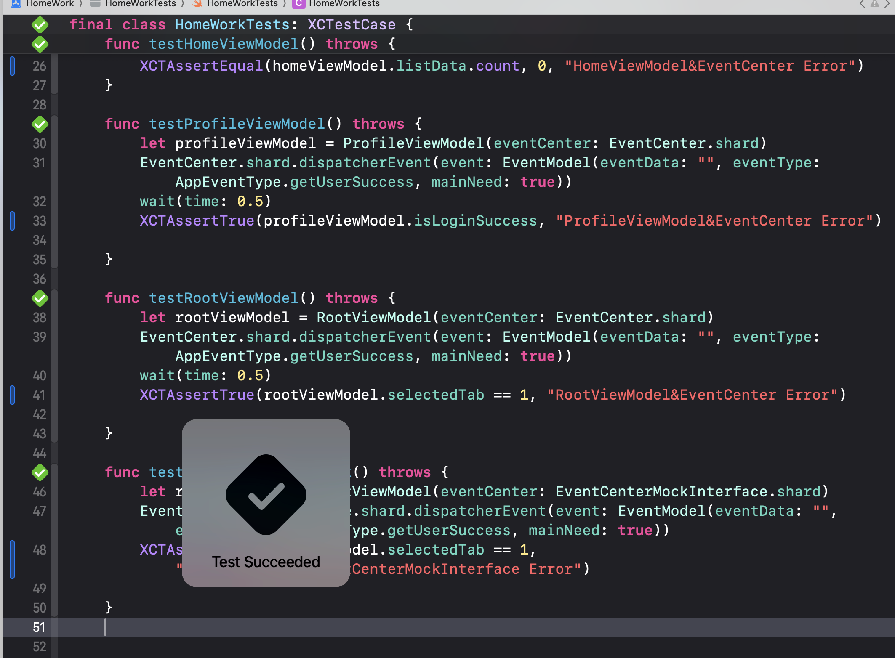
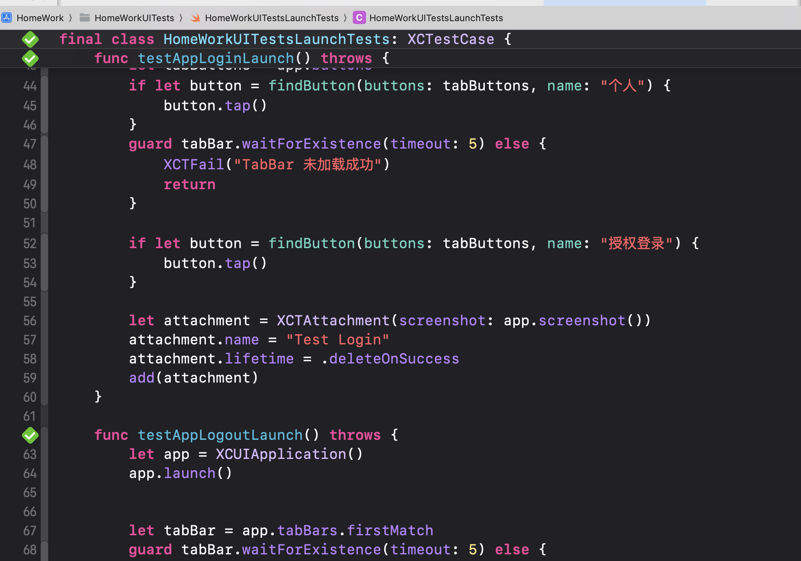
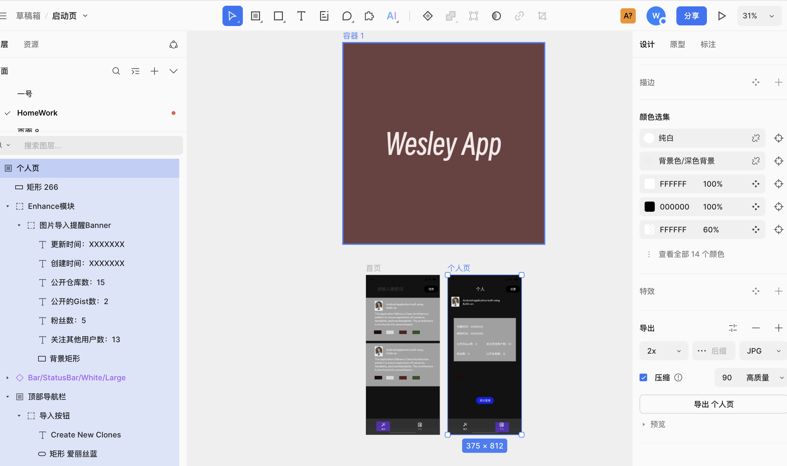
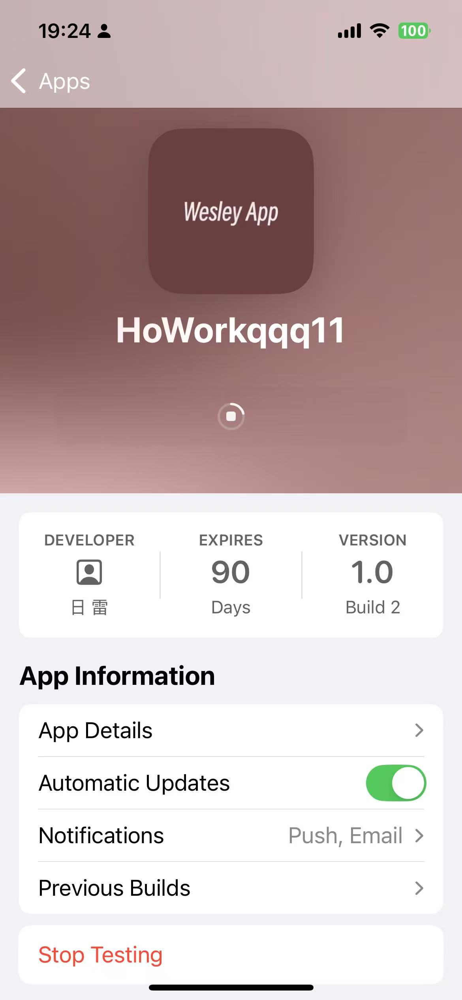
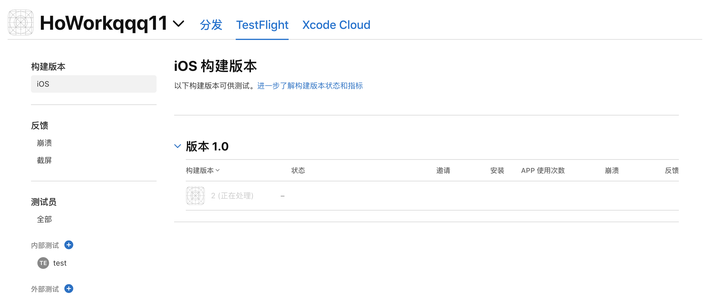
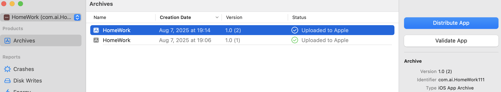
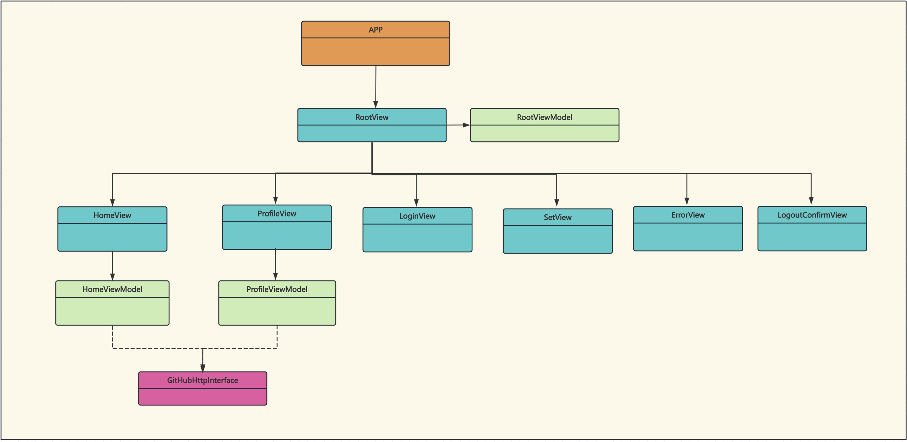
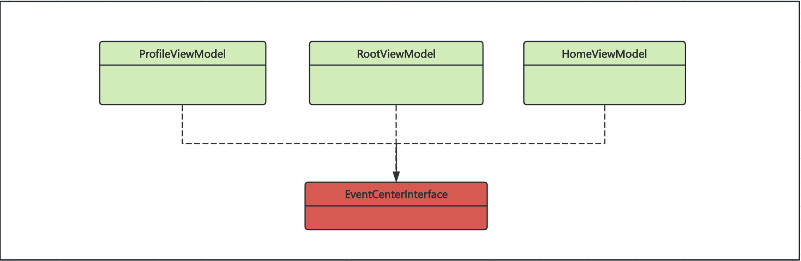

# HomeWork
This is an iOS application written in SwiftUI that interacts with the GitHub API. It supports non-login search and authorized login via GitHub accounts. After logging in, users can view their repository lists, personal information, and more.

## Architecture
The application adopts design concepts such as MVVM architecture, protocol orientation, and event response to ensure clear event flow, testability, and maintainability. The architecture is divided into the following layers:

### View
- **RootView:** Responsible for page management, with the corresponding RootViewModel handling event monitoring and UI interactions.
- **HomeView:** Responsible for displaying repository list data or search data, with the corresponding HomeViewModel handling event monitoring and UI interactions.
- **ProfileView:** Responsible for displaying personal information after login, with the corresponding ProfileViewModel handling event monitoring and UI interactions.
- **LoginView:** Responsible for displaying login authorization UI interactions.
- **ErrorView:** Responsible for displaying UI interactions for network inaccessibility and guiding network authorization.
- **LogoutConfirmView:** Responsible for displaying UI interactions for secondary confirmation of logout.
- **SetView:** Responsible for displaying App information UI interactions.

### ViewModel
- **RootViewModel:** Responsible for event handling and interaction with RootView
- **HomeViewModel:** Responsible for event handling and interaction with HomeView
- **ProfileViewViewModel:** Responsible for event handling and interaction with ProfileView

### Model
- **UserModel:** Data model for user information
- **RepositoryModel:** Data model for repository list information

### Protocols
- **GitHubHttpInterface:** GitHub HTTP request service protocol
- **EventCenterInterface:** Event flow interaction protocol

### Components
- **AlertBgView:** Functional component responsible for page pop-up interactions
- **UIKitAsyncImageView:** Image asynchronous loading component

### Test
- HomeWorkTests
- HomeWorkUITests

## Features
- GitHub authorized login
- Search
- Recommend Swift-related repositories
- Browse personal information
- Browse personal repositories

## Technology Stack
- Swift
- SwiftUI
- UIKit
- Combine
- Kingfisher
- Alamofire
- ObjectMapper
- DataStore
- Data Encryption&Decryption
- XCTest
- XCUITests
- Custom Font
- Multilingual

## Other

### Test

| HomeWorkTests | HomeWorkUITests |
| --- | :---: |
|  |  |

### Demo Video

### UI Design
| Design | home | profile | logo |
| --- | :---: | ---: |---: |
|  |  |  | |

### TestFlight
| App | Website | Local |
| --- | :---: | ---: |
|  |  |  |

### Class Diagram

| View | ViewModel |
| --- | :---: |
|  |  |

## Issues

### EventCenter
This component is responsible for the entire event flow, but there are design flaws in terms of performance. These design flaws have already been addressed in other projects, but they haven't been introduced here for the sake of demo simplicity and understandability.

### AlertBgView
There are unfriendly experiences in terms of interaction and background transparency handling, which will be further optimized in the future.

### Common Components and Classes
As for why they haven't been separated into local pods or Swift Packages, it's due to time constraints and the need to reduce the risk of the overall code functioning properly.

