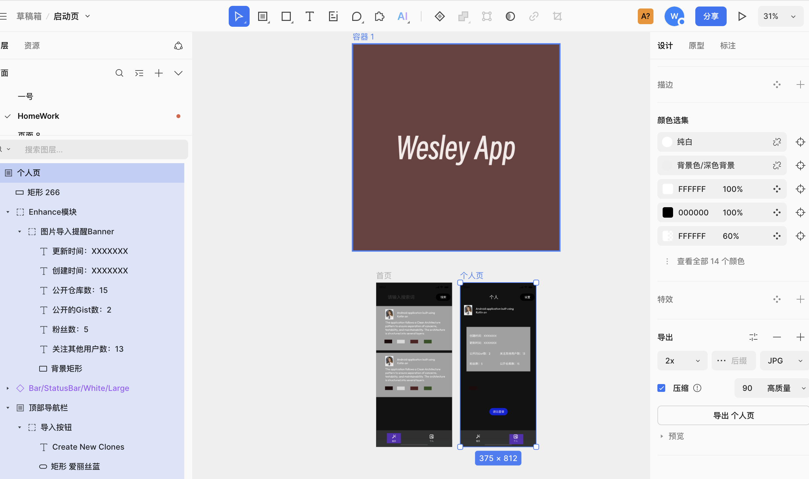
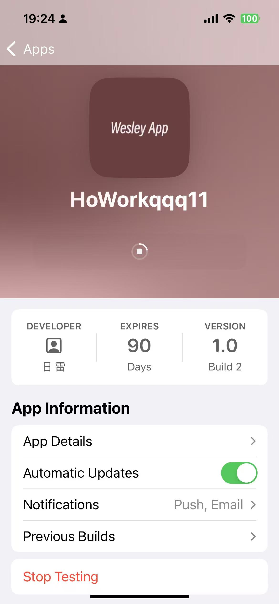
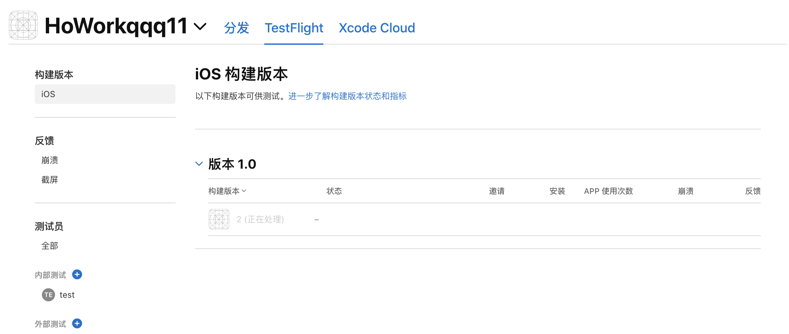
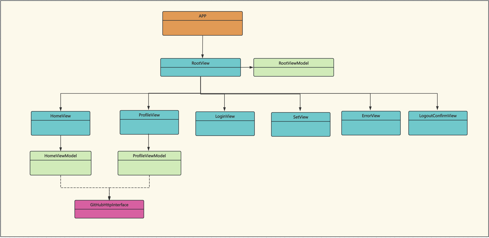

# HomeWork
这是一款使用以SwiftUI编写的iOS应用，用于与 GitHub 接口进行交互。它允许非登录搜索和GitHub账户授权登录，登录后可以查看自己的仓库列表、个人信息等。

## 架构
该应用采用MVVM架构，面向协议，事件响应等设计理念来完成，以确保事件流转的清晰、可测试性和可维护性。架构分为以下几个层级：

### UI层
- **RootView:** 负责页面管理，对应的RootViewModel负责事件监听和UI交互
- **HomeView:** 负责仓库列表数据的展示或搜素数据的展示，对应的HomeViewModel负责事件监听和UI交互
- **ProfileView:** 负责登录后的个人信息展示，对应的ProfileViewModel负责事件监听和UI交互
- **LoginView:** 负责登录授权UI交互展示
- **ErrorView:** 负责网络无法访问和引导网络授权UI交互展示
- **LogoutConfirmView:** 退出登录二次确认UI交互展示
- **SetView:** App信息UI交互展示

### ViewModel
- **RootViewModel:** 负责事件处理和RootView交互
- **HomeViewModel:** 负责事件处理和HomeView交互
- **ProfileViewViewModel:** 负责事件处理和ProfileView交互

### 数据层
- **UserModel:** 用户信息数据模型
- **RepositoryModel:** 仓库列表信息数据模型

### 协议
- **GitHubHttpInterface:** GitHub Http请求 服务协议
- **EventCenterInterface:** 事件流转交互协议

### 组件
- **AlertBgView:** 负责页面弹出交互的功能组件
- **UIKitAsyncImageView:** 图片异步加载组件

### Test
- HomeWorkTests
- HomeWorkUITests

## 功能
- GitHub授权登录
- 搜索
- 推荐Swift相关仓库
- 浏览个人信息
- 浏览个人仓库

## Technology Stack
- Swift
- SwiftUI
- UIKit
- Combine
- Kingfisher
- Alamofire
- ObjectMapper
- DataStore
- Data Encryption&Decryption
- XCTest
- XCUITests
- Custom Font
- Multilingual

## Other

### Test

| HomeWorkTests | HomeWorkUITests |
| --- | :---: |
|  |  |

### Demo Video

### UI Design
| Design | home | profile | logo |
| --- | :---: | ---: |---: |
|  |  |  | |

### TestFlight
| App | Website | Local |
| --- | :---: | ---: |
|  |  |  |

### Class Diagram

| View | ViewModel |
| --- | :---: |
|  |  |

## 问题

### EventCenter
这里负责整个事件的流转，在性能上是存在设计缺陷的。设计缺陷已经在再其他项目中得到解决，此处为了demo的简洁与易懂性没有引入。

### AlertBgView
在交互和背景透明处理上存在不友好体验，后续会继续深入优化

### 公共组件和公共类
为何没有引入本地pod或者SwiftPackage独立出来，时间不充足，还有降低代码整体跑通的风险

